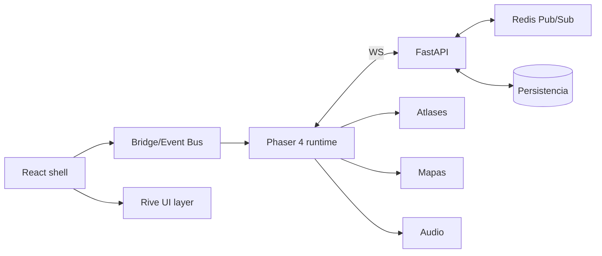
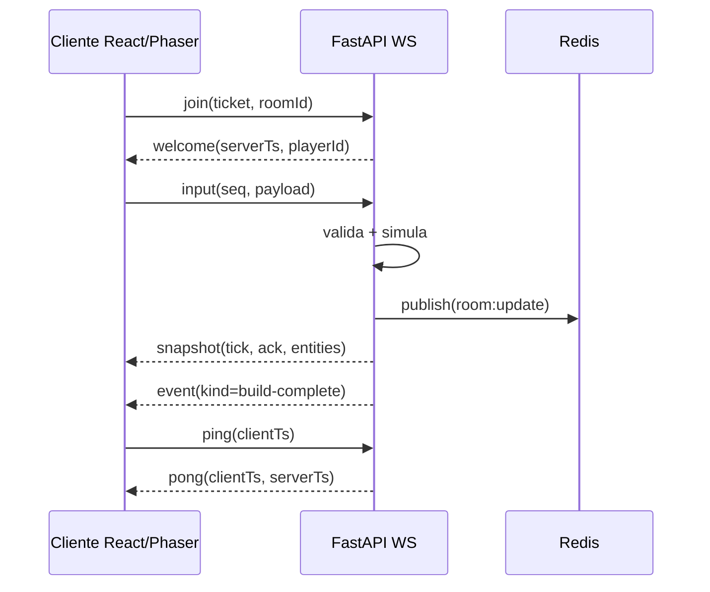
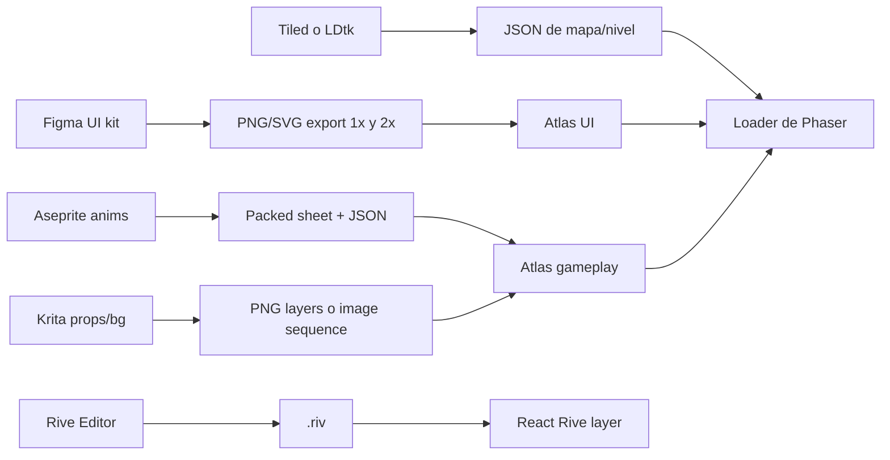
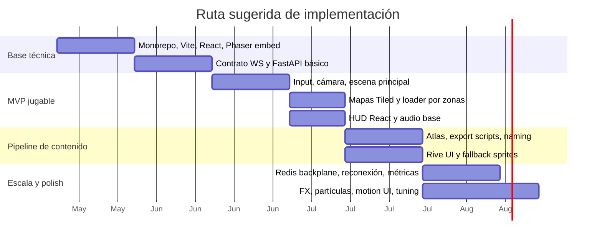

# Integración del stack técnico y dirección visual para un juego web de estrategia

## Resumen ejecutivo

La combinación **React + Vite + TypeScript** para la capa de aplicación, **Phaser 4** para simulación/rendering, y **FastAPI + WebSocket** para tiempo real es técnicamente coherente para un juego web moderno. Hoy Phaser ya ofrece **templates oficiales** para front-ends y bundlers, incluyendo **React + Vite** y variantes con TypeScript, y su documentación actual está publicada para **Phaser 4.1.0**. Además, Phaser 4 se presenta como una evolución con renderer nuevo y una API pública muy cercana a Phaser 3, lo que baja el riesgo práctico porque permite reutilizar bastante conocimiento y ejemplos heredados del ecosistema. citeturn35view0turn35view1turn35view2

La decisión arquitectónica más sólida para este proyecto es separar con nitidez responsabilidades: **React** debe gobernar shell, routing, HUD externo, tienda, overlays, auth y estado de interfaz; **Phaser** debe gobernar el loop, la cámara, el input del mundo y el render del gameplay; **Rive** debe reservarse para UI de alto valor visual y personajes/presentaciones puntuales; **Tiled** conviene como opción por defecto para mapas si quieren la ruta más directa hacia Phaser; **LDtk** conviene cuando el diseño de niveles y metadata gane peso sobre la compatibilidad directa; y **Phaser Audio** debe ser el estándar inicial, porque ya detecta Web Audio y cae a Audio Tag cuando hace falta. En ese contexto, **Howler.js no debería entrar “por si acaso”**, sino solo si aparece un caso real que Phaser no cubra bien, por ejemplo música persistente desacoplada del ciclo de escenas o un servicio de audio completamente independiente del motor. citeturn31view0turn31view1turn0search0turn0search3turn1search2turn1search6turn3search1turn4search0

La recomendación de rendering para el producto jugable es **CSR** para el cliente de juego. Vite soporta SSR y build estático, pero en un juego canvas/WebGL el valor de SSR se concentra más en marketing, landing, blog, onboarding o SEO que en el runtime jugable. En otras palabras: **CSR para el juego**, y **SSR o sitio estático solo para páginas externas** si el negocio lo necesita. Esta es una recomendación de arquitectura basada en las capacidades del stack, no una limitación técnica estricta. citeturn37search7turn30search0turn30search2turn30search4

En tiempo real, el enfoque recomendado es un modelo **server-authoritative parcial**: el servidor valida inputs, economía, combate, cooldowns, inventario y resolución final; el cliente predice únicamente aquello que mejora sensación de respuesta, como selección, path previews, feedback de input, animaciones, cámara y VFX locales. Este enfoque está alineado con arquitecturas cliente-servidor autoritativas usadas en juegos de red y con prácticas clásicas de compensación/predicción. Además, en web hay que ser conservadores con WebSockets porque la API `WebSocket` estable del navegador **no tiene backpressure**, así que conviene mantener mensajes chicos, deltas y fan-out acotado. citeturn9search0turn9search4turn9search1turn33view0

Si el objetivo visual es una sensación “tipo Clash of Clans”, no basta con copiar una paleta saturada. Lo que funciona es una combinación de **siluetas muy legibles**, materiales con lectura clara, **UI gruesa y jerárquica**, microinteracciones con “bounce” controlado, partículas rápidas y un pipeline de assets que mantenga consistencia entre mapa, props, personajes, FX y HUD. Phaser 4 ya trae una base útil para esto con filtros, luces, partículas, atlas, dynamic textures y shader-friendly tooling; Rive suma mucho valor en botones, HUD y motion UI; Figma, Aseprite y Krita cubren bastante bien la producción 2D si se les asigna un rol claro dentro del pipeline. citeturn35view1turn31view3turn29search0turn29search12turn5search1turn5search8

## Arquitectura propuesta y despliegue

La arquitectura que mejor equilibra velocidad de desarrollo, claridad y escalabilidad es un **monorepo ligero** con separación por aplicación y contratos compartidos. No es obligatorio usar un monorepo, pero sí es altamente recomendable que exista un lugar central para **tipos de protocolo**, manifest de assets y utilidades comunes. TypeScript soporta `tsconfig.json`, `extends`, `paths` y referencias entre proyectos; Vite, por su parte, soporta configuración en TS y alias absolutos en `resolve.alias`. citeturn36search5turn36search9turn36search1turn37search7turn37search11

```text
repo/
  apps/
    web/
      src/
        app/              # routing, providers, layout, auth
        ui/               # HUD React, modales, menús, tienda
        game/
          phaser/
            bootstrap/
            scenes/
            systems/
            net/
            entities/
            maps/
            fx/
          rive/
          bridge/         # event bus React <-> Phaser
        assets/
          atlases/
          rive/
          audio/
          maps/
          packs/
        hooks/
        lib/
      public/
    api/
      app/
        main.py
        ws/
        game/
        auth/
        schemas/
        services/
        infra/
        tests/
  packages/
    protocol/             # mensajes, enums, contratos, docs
    tooling/              # scripts de export/optimización
```

Esta estructura permite que React y Phaser convivan sin mezclar paradigmas. React sigue un modelo declarativo; Phaser, uno imperativo y orientado al loop. Por eso, **React no debe “renderizar” el juego**: debe **montar** una instancia de Phaser dentro de un `ref`, inicializarla con `useEffect`, y destruirla o pausarla con cleanup cuando corresponda. Esa separación está alineada con el uso de Effects para sincronizar componentes React con sistemas externos. citeturn30search4turn35view0turn35view2



Para el **frontend jugable**, conviene desplegar el build de Vite como artefacto estático en CDN. Vite genera build de producción, maneja **dynamic imports**, y permite configurar code splitting y CSS splitting. React `lazy` y `Suspense` calzan bien con esta estrategia para retrasar la carga de rutas pesadas, editor interno, replay viewer o módulos de administración. citeturn30search0turn30search2turn30search3turn30search13turn37search7

### Decisión sobre SSR y CSR

La recomendación concreta es:

| Superficie | Decisión recomendada | Motivo principal |
|---|---|---|
| Cliente jugable | **CSR** | Phaser y Rive dependen de canvas/WebGL y de inicialización en cliente; el valor de SSR aquí es bajo. |
| Landing, marketing, wiki, blog | **SSR o estático** | SEO, share previews, performance inicial y contenido indexable. |
| Lobby o cuenta | **CSR primero**; SSR solo si SEO/TTFB importa mucho | Menor complejidad y misma base Vite/React. |

Esta recomendación se basa en que Vite **sí soporta SSR**, pero su ruta simple y más natural para juegos web sigue siendo el cliente estático con lazy loading. citeturn37search7turn30search3turn30search9

### Configuración base sugerida

```ts
// apps/web/vite.config.ts
import { defineConfig } from 'vite'
import react from '@vitejs/plugin-react'
import path from 'node:path'

export default defineConfig({
  plugins: [react()],
  resolve: {
    alias: {
      '@': path.resolve(__dirname, './src'),
      '@assets': path.resolve(__dirname, './src/assets'),
      '@game': path.resolve(__dirname, './src/game'),
    },
    // En Vite 8 existe soporte integrado para tsconfig paths si lo activan.
    // tsconfigPaths: true,
  },
  build: {
    sourcemap: true,
    cssCodeSplit: true,
    rollupOptions: {
      output: {
        manualChunks: {
          phaser: ['phaser'],
          rive: ['@rive-app/react-webgl2'],
        },
      },
    },
  },
  server: {
    host: true,
    port: 5173,
  },
})
```

```json
// apps/web/tsconfig.json
{
  "extends": "../../tsconfig.base.json",
  "compilerOptions": {
    "moduleResolution": "bundler",
    "jsx": "react-jsx",
    "paths": {
      "@/*": ["./src/*"],
      "@assets/*": ["./src/assets/*"],
      "@game/*": ["./src/game/*"]
    }
  },
  "include": ["src"]
}
```

Vite documenta la configuración en TS, el uso de alias absolutos y la estrategia de code splitting; TypeScript documenta `tsconfig`, `extends`, `paths` y `moduleResolution`. Si además usan Vite 8, hay soporte integrado opcional para `tsconfig paths`. citeturn37search7turn37search11turn36search5turn36search9turn36search1turn36search11turn37search17

En backend, el despliegue recomendado es **FastAPI + Uvicorn** en contenedores, detrás de reverse proxy/LB que preserve Upgrade headers, con Redis como backplane para rooms, fan-out y presencia. Si el estado de la partida vive solo en memoria, necesitarán afinidad de sesión; si externalizan suficiente estado o fan-out en Redis, pueden relajar esa necesidad. Uvicorn soporta distintos protocolos WebSocket, ajustes de `ping`, tamaño máximo de mensaje y cola de entrada; y WSGI queda descartado porque deshabilita WebSockets. citeturn33view1turn33view2turn33view3turn33view4

## Comunicación cliente-servidor y modelo de sincronización

FastAPI soporta endpoints WebSocket con `Depends`, `Security`, `Cookie`, `Header`, `Path` y `Query`, lo que permite montar autenticación y autorización sin inventar infraestructura paralela. Además, cuando la validación falla, la vía correcta es `WebSocketException`, no `HTTPException`, y el código `WS_1008_POLICY_VIOLATION` es apropiado para rechazos por política. citeturn32view0turn32view2

### Modelo de autoridad recomendado

Para este stack, la mejor estrategia no es “todo autoritativo” ni “todo del lado cliente”, sino una partición clara:

| Dominio | Autoridad recomendada |
|---|---|
| Input de UI, hover, drag, preview de placement, cámara | Cliente |
| Resolución de combate, recursos, timers, inventario, cooldowns, path final | Servidor |
| Animaciones cosméticas locales, partículas, enfatizadores de daño | Cliente |
| Estado canónico de unidades, edificios, economía y matchmaking | Servidor |

La razón es práctica: la arquitectura cliente-servidor autoritativa reduce fraude y divergencia, mientras que la predicción local baja la fricción percibida. Valve describe explícitamente un modelo cliente-servidor donde el servidor es autoritativo sobre la simulación del mundo, y su documentación clásica de compensación de latencia sigue siendo útil para pensar predicción, interpolación y reconciliación. citeturn9search0turn9search4

### Protocolo sugerido

Para un **MVP**, JSON es suficiente y acelera muchísimo observabilidad, tooling y debugging. Si más adelante los snapshots pesan demasiado, recién ahí tiene sentido considerar un transporte binario o MessagePack. En navegador, WebSocket abre una sesión bidireccional persistente, pero la API estable no maneja backpressure; por eso conviene mantener contratos chicos y explícitos. citeturn33view0turn33view1

```ts
// packages/protocol/messages.ts
export type ClientMsg =
  | { t: 'join'; roomId: string; ticket: string }
  | { t: 'input'; seq: number; ack?: number; payload: { action: 'place' | 'move'; x: number; y: number } }
  | { t: 'ping'; clientTs: number }

export type ServerMsg =
  | { t: 'welcome'; playerId: string; serverTs: number }
  | { t: 'snapshot'; tick: number; ack?: number; entities: Array<{ id: string; x: number; y: number; hp?: number }> }
  | { t: 'event'; kind: 'hit' | 'build-complete' | 'resource-gain'; entityId?: string; value?: number }
  | { t: 'pong'; clientTs: number; serverTs: number }
```

Con ese contrato, el cliente puede medir RTT, el servidor puede ackear secuencias y las reconciliaciones se vuelven manejables. En géneros más “action-heavy”, esto se amplía a **client-side prediction + server reconciliation**; en un city-builder/raid táctico basta normalmente con **command submission + snapshots**. La cifra exacta de tick-rate depende del género, pero como punto de partida práctico conviene priorizar **consistencia y payloads pequeños** antes que ticks altos. citeturn9search0turn9search4turn33view0



### Implementación base en FastAPI

```py
# apps/api/app/main.py
from fastapi import FastAPI, Query, WebSocket, WebSocketException, status
from typing import Dict, Set
import json

app = FastAPI()

class RoomHub:
    def __init__(self) -> None:
        self.rooms: Dict[str, Set[WebSocket]] = {}

    async def connect(self, room_id: str, ws: WebSocket) -> None:
        await ws.accept()
        self.rooms.setdefault(room_id, set()).add(ws)

    def disconnect(self, room_id: str, ws: WebSocket) -> None:
        self.rooms.get(room_id, set()).discard(ws)

    async def broadcast(self, room_id: str, message: dict) -> None:
        dead = []
        for client in self.rooms.get(room_id, set()):
            try:
                await client.send_text(json.dumps(message))
            except Exception:
                dead.append(client)
        for client in dead:
            self.disconnect(room_id, client)

hub = RoomHub()

def validate_ticket(ticket: str | None) -> bool:
    return bool(ticket)  # reemplazar por firma/JWT/ticket efímero

@app.websocket("/ws/game")
async def game_ws(
    websocket: WebSocket,
    room_id: str = Query(...),
    ticket: str | None = Query(default=None),
):
    if not validate_ticket(ticket):
        raise WebSocketException(code=status.WS_1008_POLICY_VIOLATION)

    await hub.connect(room_id, websocket)
    await websocket.send_json({"t": "welcome", "roomId": room_id})

    try:
        while True:
            msg = await websocket.receive_json()
            if msg["t"] == "input":
                # validar, simular, persistir, publicar
                await hub.broadcast(room_id, {"t": "snapshot", "tick": 1, "entities": []})
    finally:
        hub.disconnect(room_id, websocket)
```

FastAPI documenta justamente este estilo de endpoint, uso de `Query`/`Cookie`/`Depends` y el rechazo con `WebSocketException`. citeturn32view0turn32view2

### Ajustes operacionales y escalabilidad

```bash
uvicorn app.main:app \
  --host 0.0.0.0 \
  --port 8000 \
  --loop uvloop \
  --ws websockets-sansio \
  --ws-max-size 1048576 \
  --ws-ping-interval 20 \
  --ws-ping-timeout 20
```

Uvicorn expone opciones específicas para implementación WebSocket, tamaño máximo, cola, `ping interval`, `ping timeout` y `per-message-deflate`. Eso permite endurecer el backend ante payloads excesivos y conexiones zombis. citeturn33view2

Para escalar horizontalmente, **Redis Pub/Sub** sirve muy bien para broadcasts efímeros de rooms, pero hay que recordar que su semántica es **at-most-once**: si un subscriber falla o se desconecta, el mensaje se pierde. Si necesitan replay, reconexión robusta, auditoría o procesamiento con garantías mejores, **Redis Streams** es mejor base porque persiste entradas y soporta más estrategias de consumo. En términos prácticos: **Pub/Sub para presencia y fan-out live**, **Streams para eventos recuperables o cola de trabajo**. citeturn33view3turn33view4

## Integración técnica del front y del motor

La integración correcta entre React y Phaser no es “usar React dentro de Phaser” ni “manejar el mundo con state de React”, sino montar Phaser como **sub-sistema aislado** usando `ref` + `useEffect`, y cruzar eventos a través de un bridge mínimo. Phaser ya documenta soporte oficial para templates con frameworks; React documenta `useEffect` como mecanismo para sincronizar componentes con sistemas externos. citeturn35view0turn30search4

### Montaje de Phaser dentro de React

```tsx
// apps/web/src/game/GameCanvas.tsx
import { useEffect, useRef } from 'react'
import { createGame, destroyGame } from './phaser/bootstrap/game'

export function GameCanvas() {
  const containerRef = useRef<HTMLDivElement | null>(null)

  useEffect(() => {
    if (!containerRef.current) return
    const game = createGame(containerRef.current)
    return () => destroyGame(game)
  }, [])

  return <div ref={containerRef} style={{ width: '100%', height: '100%' }} />
}
```

```ts
// apps/web/src/game/phaser/bootstrap/game.ts
import Phaser from 'phaser'
import { BootScene } from '../scenes/BootScene'
import { MainScene } from '../scenes/MainScene'

export function createGame(parent: HTMLElement) {
  return new Phaser.Game({
    type: Phaser.AUTO,
    parent,
    width: 1280,
    height: 720,
    backgroundColor: '#1f2430',
    scene: [BootScene, MainScene],
  })
}

export function destroyGame(game: Phaser.Game) {
  game.destroy(true)
}
```

Este patrón evita rerenders innecesarios, reduce acoplamiento y permite que React siga siendo la capa de interfaz declarativa. Cuando el shell necesite hablar con Phaser, háganlo mediante EventTarget, un emisor simple o un bridge explícito, nunca leyendo el estado interno del motor desde componentes React en cada render. citeturn30search4turn35view2

### Animación con Rive y fallback a sprites

Rive ofrece un runtime React oficial donde `@rive-app/react-webgl2` es la opción recomendada; `react-canvas` y `react-canvas-lite` existen, pero con límites funcionales y visuales mayores. Rive además está posicionado explícitamente para menus, HUDs, UI interactiva y gráficos 2D de juego con state machines. citeturn31view0turn31view1turn31view3

```tsx
// apps/web/src/game/rive/HeroPortrait.tsx
import Rive from '@rive-app/react-webgl2'

export function HeroPortrait() {
  return (
    <Rive
      src="/assets/rive/hero_portrait.riv"
      stateMachines="ui_sm"
      artboard="Main"
    />
  )
}
```

**Comparativa de decisión: Rive vs sprites/Phaser**

| Opción | Cuándo usarla | Ventajas | Costos o límites |
|---|---|---|---|
| **Rive** | HUD, botones, portraits, menús, onboarding, personajes “hero” con poca multiplicidad | Motion UI rica, state machines, muy buena fidelidad vectorial con renderer dedicado | Peor candidato para cientos de actores repetidos en mundo; otra capa/runtime más que mantener |
| **Sprites con Phaser** | Unidades masivas, FX repetidos, gameplay central, enemigos/proyectiles | Integración directa con atlases, Aseprite y anim manager de Phaser; mejor para cantidades grandes | Menos flexible para UI interactiva compleja y motion design avanzado |

La tabla sintetiza la documentación de Rive React/renderer y el pipeline de animaciones/sprites de Phaser. citeturn31view0turn31view1turn31view3turn29search0turn29search3turn29search10

La recomendación concreta es: **Rive para UI y personajes estrella**, **sprites para gameplay repetido**. Si una animación Rive falla, es demasiado pesada o necesita vivir dentro del mundo Phaser con muchas instancias, el fallback natural es exportarla a sprite sheet/atlas y reproducirla vía `this.anims.createFromAseprite(...)` o `this.anims.create(...)`. Phaser soporta carga Aseprite compatible y creación directa de animaciones desde ese JSON. citeturn29search0turn29search5turn29search10turn29search11

### Tiled y LDtk

Tiled y LDtk no compiten exactamente por lo mismo. **Tiled** es más generalista y flexible: orientaciones de mapa, capas, objetos libres, propiedades custom y compatibilidad muy extendida. Su JSON es especialmente conveniente en navegador/JavaScript, y Phaser ofrece carga oficial vía `tilemapTiledJSON`. **LDtk**, en cambio, brilla cuando el diseño se organiza alrededor de **niveles**, **world layouts**, **IntGrid**, **auto-layers** y entidades con metadata mucho más estructurada. citeturn0search8turn0search4turn0search6turn0search0turn0search3turn1search2turn1search3turn1search1turn1search7

**Comparativa de decisión: Tiled vs LDtk**

| Opción | Conviene más cuando… | Ventajas | Costos o límites |
|---|---|---|---|
| **Tiled** | Quieren integración más directa con Phaser y mapas variados | JSON fácil de cargar en browser; soporte directo en Phaser; objetos y propiedades custom muy conocidos | Menos opinionado para metadata de gameplay “entity-first” |
| **LDtk** | Quieren nivel/world design muy estructurado y auto-layers potentes | `levels`, `layerInstances`, `IntGrid`, `autoTiles`, world layouts y metadata clara | Phaser no lo consume tan directo como Tiled; normalmente requiere adapter propio |
| **LDtk exportando TMX** | Solo como compatibilidad transitoria | Permite puentear motores que esperan TMX | La propia doc de LDtk dice que es una solución temporal y recomienda parsear JSON para mejores resultados |

La síntesis se apoya en la documentación oficial de Tiled, Phaser y LDtk. citeturn0search0turn0search3turn0search4turn0search6turn0search8turn1search1turn1search2turn1search3turn1search4turn1search6turn1search7

**Recomendación práctica:** si el equipo parte hoy y quiere llegar rápido a una demo estable, usen **Tiled como estándar inicial**. Si más adelante el trabajo de diseño pide más semántica de nivel, migran algunas zonas o herramientas internas hacia LDtk.

#### Importar Tiled a Phaser

```ts
// dentro de una Scene
preload() {
  this.load.tilemapTiledJSON('zone-01', '/assets/maps/zone-01.json')
  this.load.image('terrain', '/assets/tilesets/terrain.png')
}

create() {
  const map = this.make.tilemap({ key: 'zone-01' })
  const tiles = map.addTilesetImage('terrain', 'terrain')
  map.createLayer('Ground', tiles!, 0, 0)
  map.createLayer('Decor', tiles!, 0, 0)
}
```

Phaser documenta `this.load.tilemapTiledJSON(key, url)` como ruta oficial para Tiled JSON. citeturn0search0turn0search3

#### Importar LDtk a Phaser

LDtk expone en JSON `levels`, `layerInstances`, `gridTiles`, `autoTiles`, `entityInstances` y world layouts. En Phaser, lo más sano es escribir un adapter pequeño que traduzca el JSON de LDtk a capas/objetos del runtime. El export a TMX existe, pero la propia documentación lo describe como transitorio. citeturn1search2turn1search3turn1search4turn1search6

```ts
type LdtkLevel = {
  layerInstances: Array<{
    __identifier: string
    __type: string
    gridTiles?: Array<{ px: [number, number]; src: [number, number] }>
    autoTiles?: Array<{ px: [number, number]; src: [number, number] }>
    entityInstances?: Array<{ __identifier: string; px: [number, number] }>
  }>
}

function spawnLdtkLevel(scene: Phaser.Scene, level: LdtkLevel) {
  for (const layer of level.layerInstances) {
    if (layer.__type === 'EntityLayer') {
      for (const e of layer.entityInstances ?? []) {
        scene.add.sprite(e.px[0], e.px[1], 'entities', e.__identifier)
      }
    }
    // Para TileLayer / AutoLayer conviene construir TilemapLayer o blits
    // según su volumen y frecuencia de cambio.
  }
}
```

### Audio: Phaser Audio primero, Howler solo si aparece una necesidad real

Phaser ya trae un **Sound Manager** integrado que usa Web Audio cuando el navegador lo soporta y cae a **Audio Tag** cuando no. Howler, por su lado, también se presenta como librería moderna de audio que usa Web Audio por defecto y cae a HTML5 Audio. Por eso, usar Howler “como fallback” genérico para Phaser es en gran parte redundante. citeturn3search1turn4search0turn4search9

**Comparativa de decisión: Howler vs Phaser Audio**

| Opción | Recomendación | Fortalezas | Cuándo evitarla |
|---|---|---|---|
| **Phaser Audio** | **Predeterminado** | Integrado con escenas, assets, audio sprites y ciclo del juego; ya maneja fallback de navegador | Si quieren un servicio de audio totalmente externo al motor |
| **Howler.js** | **Opcional** | API consistente, Web Audio + HTML5 Audio fallback, útil como capa de audio independiente | Como “fallback por defecto” de Phaser; agrega complejidad si no resuelve un problema real |

La recomendación concreta es mantener una sola autoridad de audio al inicio. Si más adelante necesitan música persistente entre cambios de escena React, crossfade global o audio de shell independiente del canvas, ahí sí vale la pena introducir Howler como servicio separado. citeturn3search1turn4search0turn4search9

## Pipeline de assets y flujo para artistas

La manera más eficiente de trabajar con **Aseprite, Krita y Figma** no es que todas hagan todo, sino asignarles papeles claros:

| Herramienta | Rol recomendado |
|---|---|
| **Aseprite** | Sprites frame-by-frame, efectos cortos, sheets compatibles con Phaser |
| **Krita** | Props pintados, fondos, ilustración 2D y animación raster por secuencia |
| **Figma** | HUD, iconografía, layout de pantallas, librerías UI, export de assets y variables visuales |

Figma documenta exportes configurables, formatos y perfiles de color; también librerías reutilizables de componentes, estilos y variables. Krita documenta animación raster frame-by-frame y render a secuencia de imágenes/video. Phaser documenta carga directa de Aseprite y creación de animaciones desde su JSON compatible. citeturn5search1turn5search11turn5search13turn5search8turn5search0turn29search0turn29search5



### Formatos y export

Para **UI**, prioricen export desde Figma a **PNG** para raster final y **SVG** solo cuando el asset de verdad vaya a vivir como vector en DOM o como insumo para otra herramienta. Figma permite múltiples configuraciones de export y control de perfil de color; para juego web, si no tienen una gestión de color completa extremo a extremo, **sRGB** es la opción más segura y consistente. citeturn5search1turn5search11

Para **sprites de gameplay**, prioricen **PNG + JSON** empaquetado. Phaser soporta atlas JSON, multi-atlas y Aseprite JSON compatible, y su documentación incluso indica cómo exportar desde Aseprite en formato “Packed” para que `createFromAseprite` funcione correctamente. Cuando un sheet ya no quepa razonablemente en una textura, usen **multi-atlas** para fragmentarlo sin romper el pipeline del motor. citeturn29search0turn29search5turn29search12turn29search14

Para **ilustración raster** y props pintados, Krita funciona bien como fuente maestra. Cuando haya animación pintada o hand-drawn, lo más limpio para juego es exportar **image sequence** y luego empacarla a sheet/atlas mediante tooling propio o de build. Krita documenta precisamente render de animación a secuencia e integra FFmpeg para salidas animadas. citeturn5search0turn5search6turn5search8

### Atlas, resolución y retina

La regla útil aquí es separar tres clases de asset:

- **UI e iconos**: sí conviene generar variantes **1x y 2x**, porque Figma permite múltiples configuraciones de export y es donde la nitidez en pantallas densas más se nota. citeturn5search1turn5search11
- **Sprites de gameplay masivos**: mejor una resolución base consistente y una cámara bien calibrada; duplicar todo a 2x dispara memoria y build size muy rápido. Esta es una recomendación de pipeline.
- **Hero art / portraits / splash / loading**: sí justifican assets más grandes o Rive, porque son pocos y muy visibles. citeturn31view3

Además, separen atlases por dominio funcional: `ui`, `units`, `fx`, `buildings`, `tilesets`. Phaser también soporta **Pack Files**/Asset Packs, lo que vuelve más ordenada la carga por escenas o features. La propia documentación recomienda más de un Asset Pack, al menos uno para preloader y otro para el resto del juego. citeturn34search3turn34search9turn34search10turn34search5

## Performance, testing y operación

En frontend, la primera optimización rentable no está en micro-ajustar shaders, sino en **reducir lo que el usuario descarga al inicio**. React `lazy` + `Suspense` permiten cargar componentes diferidos; Vite reescribe imports dinámicos con preload paralelo y mantiene CSS code-splitting cuando corresponde. En práctica, esto significa separar la ruta de juego, el editor/debug HUD, replay tools y vistas administrativas en chunks distintos. citeturn30search0turn30search2turn30search3turn30search13

Dentro de Phaser, conviene combinar tres ideas: **Asset Packs**, **carga por escenas** y **control del tipo de asset que llega al runtime**. Phaser documenta el Loader, Pack Files, atlases y multi-atlas; eso permite un flujo donde el preloader solo trae lo mínimo para boot/menu y cada zona carga su propio pack. Esta estrategia suele rendir mucho más que “un solo mega preload”. citeturn34search1turn34search3turn34search9turn34search10turn29search12

Hay que considerar también degradación visual: los **FX** de Phaser son funcionalidad **WebGL-only**, no están disponibles en Canvas mode. Por eso, si van a usar glow, blur, bloom, displacement o color grading como parte del look, deben tratarlos como **enhancement**, no como dependencia absoluta de legibilidad. Para iluminación, Phaser diferencia entre luces tradicionales y Point Lights más baratos; y para cifras/HUD muy legibles, `BitmapText` sigue siendo una herramienta valiosa. citeturn3search9turn3search17turn3search11

En memoria y frame pacing, la regla práctica es simple: no creen basura por frame si pueden evitarlo. Pools para proyectiles y partículas, arrays reutilizables para queries del mundo, y evitar serializar estados completos por WebSocket cuando basta con deltas. Esto no viene dado por una sola doc, pero sí cae naturalmente de las restricciones del loop, del costo de WebSocket sin backpressure y del volumen que puede mover un renderer moderno. citeturn33view0turn35view1

### Testing y debugging recomendados

Para pruebas de unidad y componentes, **Vitest** es la opción más natural en un proyecto Vite: comparte pipeline, plugins y config del app, y está explícitamente posicionado como test runner de nueva generación “powered by Vite”. Además, hoy tiene browser mode y puede trabajar con provider Playwright. citeturn7search0turn7search1turn7search4

Para E2E, **Playwright** sigue siendo la mejor pieza para rutas críticas: login, preload, reconexión, match join, compra, settings y degradación móvil. La documentación oficial destaca aislamiento, paralelización, soporte cross-browser, CI, inspector, codegen y traces. citeturn6search1turn6search9turn6search11turn6search13turn6search15turn6search19

En backend, FastAPI facilita bastante las pruebas con `TestClient`, e incluso documenta pruebas de WebSockets y overrides de dependencias dentro de su tutorial de testing. Eso hace razonable mantener tests de contrato, tests de endpoints HTTP y tests de WS en el mismo repo del API. citeturn8search0

Una distribución concreta de testing quedaría así:

| Capa | Herramienta |
|---|---|
| Utilidades TS, reducers, transforms, adapters, serializers | **Vitest** |
| Componentes React/HUD | **Vitest** y, si hace falta, browser mode |
| Flujo de usuario completo | **Playwright** |
| API HTTP/WS | **FastAPI TestClient** + tests específicos de WS |
| Smoke visual de performance | Browser DevTools + builds de staging |

## Dirección visual tipo Clash of Clans

Si quieren una estética dentro de esa familia visual, la meta no debería ser “copiar Clash of Clans”, sino reproducir sus **principios de legibilidad y “juiciness”** en su propia identidad. Técnicamente, Phaser 4 ya da herramientas suficientes para gran parte de ese acabado: filtros, luces, partículas, shake, glow, bloom-like pipelines, cámaras, atlas y motion combinables con UI Rive. citeturn35view1turn31view3turn3search9turn3search17

### Paleta y materiales

Trabajen con una paleta de **bases relativamente cálidas y saturadas**, pero no dejen todo al mismo nivel de intensidad. Una buena jerarquía visual suele seguir esta lógica:

| Capa visual | Recomendación |
|---|---|
| Terreno/base | Saturación media, contraste moderado, texturas amplias |
| Interactivos principales | Saturación alta, borde claro y lectura inmediata |
| Recursos premium / CTA | Color muy distinguible y consistente en todo el juego |
| Sombras | Más frías y blandas que “negras” |
| Highlights | Cálidos, cortos y con lectura de material |

Esto no es una regla “oficial” de producto específico; es una recomendación de dirección de arte para acercarse a la claridad visual de los strategy builders mobile.

### UI e iconografía

Las UIs de este tipo funcionan cuando los elementos se sienten **grandes, táctiles y casi juguetes**. Eso implica:

- Botones con volumen aparente, sombra interna/externa ligera y una silueta muy limpia.
- Cápsulas o paneles con jerarquía fuerte para recursos, timers y builders.
- Iconos simplificados, con pocos planos de sombra y lectura instantánea a tamaño pequeño.
- Números y temporizadores extremadamente legibles; `BitmapText` o un font custom muy controlado ayudan mucho. citeturn3search11

Rive rinde especialmente bien aquí: botones con hover/tap state, contadores animados, barras de progreso, portraits reactivos, reward reveals y HUD state-driven. Phaser puede hacerse cargo de FX cosméticos de apoyo en el mundo. citeturn31view0turn31view3turn3search9

### Composición y microinteracciones

La sensación “premium” en este tipo de juego viene mucho de pequeñas respuestas:

| Microinteracción | Implementación recomendada |
|---|---|
| Tap en botón | scale up breve + overshoot + click sonoro corto |
| Construcción terminada | puff, sparkle, pulse del edificio, badge temporal |
| Recompensa | burst de partículas + conteo animado + sonido ascendente |
| Impacto de combate | hit flash corto + shake mínimo + debris muy breve |
| Hover/selección | outline suave, glow pequeño, shadow lift |

La clave es la duración: si todo rebota demasiado, termina sintiéndose infantil o cansador. En general, conviene que la mayor parte de estas microinteracciones duren poco y tengan **ease out** clara, no oscilación larga.

### Efectos y partículas

Usen partículas y FX como **acentos**, no como overlay permanente. Phaser 4 ya ofrece FX unificados y opciones de iluminación; pero, como varios efectos dependen de WebGL, diseñen un baseline que se siga viendo bien incluso sin ellos. Una receta efectiva para este estilo es:

- polvo y puffs cortos en contacto con terreno;
- chispas/coins/gems muy reconocibles;
- un glow pequeño para selección o premio, no un blur omnipresente;
- luces puntuales en elementos hero más que luces globales complejas;
- foreground discreto para dar profundidad sin entorpecer lectura. citeturn3search9turn3search17turn35view1

En personajes y props, eviten animaciones largas y complejas en masa. Es mejor tener **idles cortos, secundarios claros y poses fuertes**. Reserven la animación más rica para héroes, pantallas de meta, portraits o UI narrativa; ahí Rive suma mucho más retorno que en 200 unidades simultáneas. citeturn31view0turn31view3

## Fases de implementación y esfuerzo abierto

La forma menos riesgosa de ejecutar este stack es por capas: primero arquitectura y contrato, luego gameplay mínimo, después pipeline de contenido, y recién al final polish visual profundo.



### Checklist por fase

| Fase | Entregables | Esfuerzo |
|---|---|---|
| **MVP técnico** | Monorepo, React shell, embed Phaser, ruta `/play`, WebSocket básico, auth ticket, escena boot/main, un mapa, un loop de interacción | **Medio** |
| **MVP jugable** | HUD React, sincronización autoritativa mínima, snapshots, un tileset, un preloader, SFX, deploy de staging | **Medio** |
| **Contenido base** | Pipeline Aseprite/Krita/Figma, naming, atlas, Asset Packs, primeras animaciones Rive, import Tiled o adapter LDtk | **Medio** |
| **Features** | rooms, reconexión, replay corto, analytics, inventario/progresión, content streaming por zonas | **Medio/Alto** |
| **Polish visual** | partículas, FX, sound mix, motion UI, tuning de tiempos, art pass unificado, mobile optimization | **Alto** |
| **Escalabilidad** | Redis backplane, separación Pub/Sub vs Streams, observabilidad, carga concurrente, hardening WS | **Medio/Alto** |

### Estimación abierta por tarea

| Tarea | Complejidad | Comentario |
|---|---|---|
| Integrar React + Phaser correctamente | **Media** | Técnica simple, pero fácil de hacer mal si se mezcla state declarativo con loop imperativo |
| FastAPI + WS con rooms y auth | **Media** | El MVP sale rápido; la dificultad sube con reconexión, fan-out y validación |
| Pipeline Tiled + Phaser | **Baja/Media** | Es la ruta más directa |
| Pipeline LDtk + Phaser | **Media/Alta** | Requiere adapter estable y disciplina de datos |
| Rive para HUD y menús | **Media** | Muy rentable si se acota bien el scope |
| Rive para gameplay masivo | **Alta** | Normalmente no conviene |
| Atlas, packs y lazy loading | **Media** | Mucho impacto real en performance |
| Estética “tipo strategy mobile premium” | **Alta** | El acabado visual consistente siempre cuesta más de lo que parece |
| Escalado backend multi-instancia | **Media/Alta** | Depende del grado de autoridad, rooms y recuperación de eventos |

La secuencia más recomendable, en simple, es esta: **primero Tiled + Phaser + Phaser Audio + FastAPI WS + React shell en CSR**; **después** Rive para HUD/presentación; **luego**, si el diseño de niveles lo justifica, evaluar LDtk en zonas nuevas o con adapter dedicado. Ese orden minimiza riesgo, evita sobreingeniería temprana y deja el polish visual para una etapa donde la base técnica ya no se mueve. citeturn35view0turn35view1turn3search1turn31view0turn0search0turn1search6turn32view0turn33view2